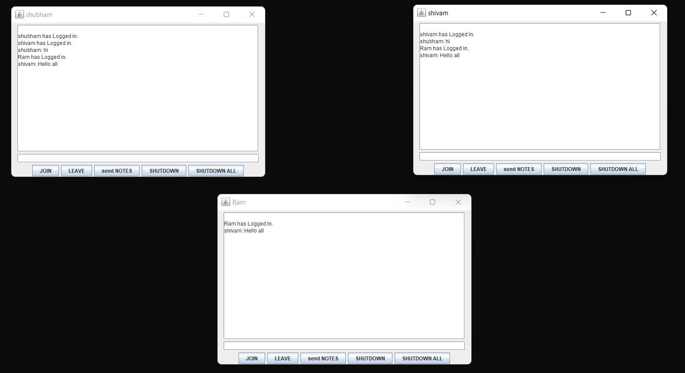
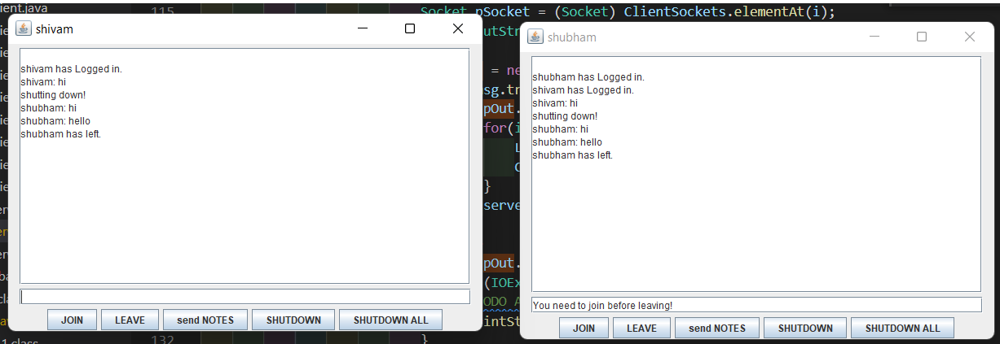

# JAVA TCP/IP SOCKET BASED SERVER CHAT APPLICATION

## Tested on:
 - Windows 11
 - PORT 7777 should be free

## Requirements:
 - Install Jdk8
 - Setup path

## Setup:
 1) Run Server.bat
 2) Run Client.bat

## Instruction:
 - Write Your name and click "JOIN"
 - There are different options Like "NOTES","LEAVE","SHUTDOWN","SHUTDOWN ALL"
 

